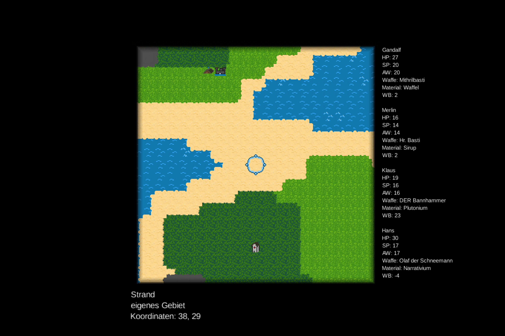

# Das Heldenprojekt

Das Heldenprojekt ist ein kleines Spiel, welches ich für den Informatik-Unterricht geschrieben habe. Der Fokus liegt hier auf der Umsetzung, nicht primär auf Grafik und Spielspaß.

## Inhalt
- [Lokale Installation](#lokale-installation)
- [Spielmechaniken](#spielmechaniken)
- [Keybinds](#keybinds)
- [Code-Struktur](#code-und-assets)
- [Lizenz](#lizenz)

## Lokale Installation

Da das Spiel in Java geschrieben ist, muss Java installiert sein. Die restliche Installation ist für Windows, Linux und Mac OS X gleich.

1. Repository klonen oder herunterladen
2. In das Verzeichnis wechseln
3. `./gradlew run` ausführen
4. Spielen

Ist der [Java-Editor](https://javaeditor.org/doku.php) erwünscht, kann auch mittels `./gradlew jar` eine Dependency-Datei erstellt werden, die in den Java-Editor importiert werden kann.
Die weiteren Dateien können dann in den Java-Editor kopiert werden. Bei einer Binärverteilung dieses Projektes wird eine entsprechende Datei mitgeliefert.

Der lokale Installationspfad ist `%APPDATA%\Chris B\Heldenprojekt\0.1\` (Windows, kann unter Linux und MacOS abweichen).

## Spielmechaniken

Nachdem das Spiel gestartet ist, sieht man einige Information auf dem Bildschirm: 
- Zentral ist das Spielfeld, auf dem sich das Camp, der Heiler und die bösartigen Burgen befinden.
- Unten werden Informationen über die aktuelle Cursor-Position angezeigt.
- Rechts werden die aktuellen Heldendaten angezeigt.

### Heldendaten
Zuerst kommt der Name, dann die Lebenspunkte, die aktuelle Stärke und Angriffswert und schlussentlich die aktuelle Waffe samt Waffenbonus.

### Navigation auf dem Spielfeld
Mit den Pfeiltasten kann man den Cursor auf dem Spielfeld bewegen. 
Das Camp kann mit der Enter-Taste an die aktuelle Cursor-Position gesetzt werden, allerdings nur, wenn der Untergrund nicht Wasser oder Gebirge ist.
Dies ist wichtig, um Aktionen auszuführen. Hierfür wird zuerst das Camp neben eine Burg oder den Heiler gesetzt und dann mit der Enter-Taste bestätigt.
Danach wird die Aktion mit der Leertaste gestartet.

### Kampf
Der Kampf ist ein einfacher Kampf, bei dem der Held mit seiner Stärke angreift und der Gegner mit seiner Stärke verteidigt.
Der Kampf endet, wenn einer der beiden Gruppen keine Lebenspunkte mehr hat.
Um den Kampf zu starten, muss das Camp neben eine Burg platziert werden und dann mit der Enter-Taste und der Leertaste bestätigt werden.
Daraufhin öffnet sich das Kampfmenu, hier kann man mit f den Kampf starten.

### Heilung
Um den Heiler zu besuchen, muss das Camp neben den Heiler platziert werden und dann mit der Enter-Taste und der Leertaste bestätigt werden.
Der Heiler hat eine Wartebank, in der Helden warteten, bis sie geheilt werden können.
Mit der Taste e können alle Helden in der aktuellen Gruppe auf die Wartebank gesetzt werden, sofern Platz ist.
Nach 5s wird der nächste Held geheilt und alle anderen Helden werden um eine Position nach vorne geschoben.

### Speichern und Laden
Das Spiel wird automatisch geschpeichert, wenn eine Aktion ausgeführt wird.
Beim Start wird der letzte Spielstand geladen.

### Screenshots

Mit der Taste F2 kann ein Screenshot erstellt werden, der im Spieleordner abgelegt wird.

## Keybinds
- Bewegen des Cursors: Pfeiltasten
- Camp setzen: Enter
- Aktion ausführen: Leertaste
- Kampf starten: f
- Alle Helden auf die Wartebank setzen: e
- Screenshot erstellen: F2
- Spiel beenden / GUI schließen: Escape
- Bildschirmgröße ändern: (+): u, (-) j

## Code und Assets
Der Quellcode ist in mehrere Module aufgeteilt:
- `core` ist das Hauptmodul, welches die Spielmechaniken implementiert. Hier ist kein platformabhängiger Code enthalten.
- `desktop` ist das Desktop-Modul, welches die Spielmechaniken auf die Desktop-Plattform anwendet. Hier ist der platformabhängige Code enthalten.
- `assets` ist das Assets-Modul, welches die Assets für das Spiel bereitstellt. Hier sind die Bilder und Audio-Dateien enthalten.
- `scripts` ist das Scripts-Modul, welches die Skripte für das Spiel bereitstellt. Hier sind die Skripte für die Generierung einiger Assets enthalten.

Die Mainklasse heißt im core-Modul `io.bloeckchengrafik.heldenprojekt.Heldenprojekt`.

Nachfolgende Absätze beschreiben die Code-Struktur im Detail, bezogen auf das `core`-Modul, da hier die Hauptlogik implementiert ist.

### Spielgeschehen
Das Spielgeschehen ist im Package `io.bloeckchengrafik.heldenprojekt.game` implementiert. Hier sind vor allem die Klassen für Kämpfe, Monster und Held implementiert.

### Benutzeroberfläche
Die Benutzeroberfläche ist im Package `io.bloeckchengrafik.heldenprojekt.gui` implementiert. 
Das Interface `GUI` ist eine Abstrahierung einer Benutzeroberfläche, von ihm erben sowohl der Ladebildschirm als auch das eigentliche Spiel.
Die Klasse `GameGUI` ist die eigentliche Benutzeroberfläche, die die Welt darstellt und die Aktionen des Spielers verarbeitet.
In der Klasse `HealerGUI` ist die Benutzeroberfläche für den Heiler implementiert, wobei sich die Klasse `FightGUI` um die Kampfmechanik kümmert.

### Speichern und Laden
Das Speichern und Laden ist im Package `io.bloeckchengrafik.heldenprojekt.save` implementiert.
Die Klasse `SaveFile` kümmert sich um das Speichern und Laden der Spielstände. Es wird hier eine weitere Klasse als Datenspeicherung verwendet. 
Die Serialisierung und Deserialisierung der Spielstände erfolgt über das Java-Interface `Serializable`.
In der finalen Datei wird ein Byte-Array gespeichert, welches die Serialisierung der Spielstände enthält, welches aber erst in renderbaren Ascii-Text umgewandelt wird, um im Textdateiformat zu bleiben.
Nach einem Neustart kann diese Datei einfach wieder geladen werden.

### Utilities
Die Utilities sind im Package `io.bloeckchengrafik.heldenprojekt.util` implementiert. 
Hier kümmert sich die Klasse `BinaryUtils` um die oben beschriebene Serialisierung und Deserialisierung der Spielstände.
Die Klasse `ScaledResolution` enthält Methoden, um die Auflösung des Bildschirms zu skalieren und zu zentrieren, damit das Spiel auf allen Bildschirmen gleich aussieht.

### World
Die Welt ist im Package `io.bloeckchengrafik.heldenprojekt.world` implementiert.
Die Klasse `World` ist die Welt, in der sich die Helden bewegen und die Kämpfe stattfinden.
Der `WorldLoader` macht die Welt als libGDX-Asset-Datei verwendbar, damit sie während dem Laden des Spiels geladen werden kann.
Das `EvilCastle` ist die Burg, in der die Helden kämpfen können und die Monster wohnen.
Der `Healer` ist der Heiler, der die Helden heilen kann.

## Lizenz
Das Spiel ist unter der MIT-Lizenz veröffentlicht.
Nähere Informationen zur Lizenz sind in der Datei `LICENSE` zu finden.